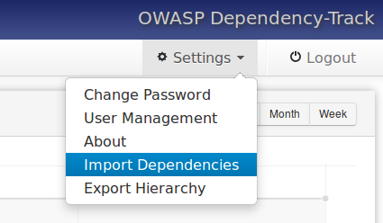
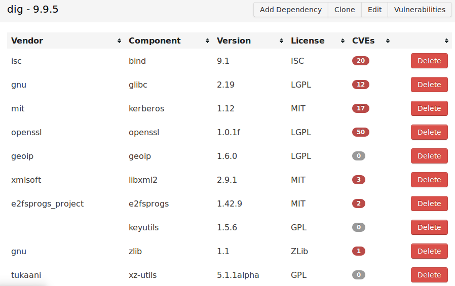
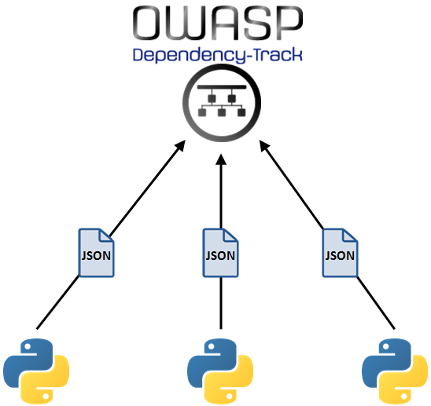

# dependency-track-plugin
A Dependency-Track Plugin (OWASP)



## A. PRELIMINARIES

**All actions of this part will be made only once !**

The following commands are suitable for a 64 bits Ubuntu machine. If your machine is another system, you can easily adapt commands.

Dependency-Track requires a Java servlet. I chose Tomcat7. If you want to choose another one, the commands must be changed accordingly.

### A.1. Dependency-Track requirements
```
sudo apt-get update
sudo apt-get upgrade
```
##### Installing OpenJDK :
```
sudo apt-get install openjdk-7-jdk openjdk-7-jre
export JAVA_HOME=/usr/lib/jvm/java-1.7.0-openjdk-amd64
```
##### Installing Tomcat7 :
```
sudo apt-get install tomcat7 tomcat7-admin tomcat7-docs tomcat7-examples
sudo chown -R tomcat7:tomcat7 /var/lib/tomcat7/ /etc/tomcat7/ /usr/share/tomcat7
```
##### Installing Maven :
```
sudo apt-get install maven
```
### A.2. Downloading Dependency-Track and Plugin sources
Dependency-Track sources : [Dependency-Track](https://github.com/stevespringett/dependency-track)

Plugin sources : [This github](https://github.com/florent-fauvin/dependency-track-plugin)

The following commands will be valid if the sources are put in a same folder, named "~/dtrack".
You can obviously do otherwise, but the commands must be changed accordingly.
```
mkdir ~/dtrack
cp path/to/Plugin ~/dtrack
cp path/to/dependency-track-master ~/dtrack
cd ~/dtrack
```
### A.3. Including the Plugin sources in the Dependency-Track sources
```
cp Plugin/dependency-track/sources/page.jsp \
	dependency-track-master/src/main/webapp/WEB-INF/views/templates/page.jsp

cp Plugin/dependency-track/sources/ApplicationController.java \
	dependency-track-master/src/main/java/org/owasp/dependencytrack/controller/ApplicationController.java
```
### A.4. Compiling and starting (pluged) Dependency-Track
```
cd ~/dtrack/dependency-track-master
mvn clean -Dmaven.compiler.failOnError=false package

sudo /etc/init.d/tomcat7 stop
sudo cp target/dtrack.war /var/lib/tomcat7/webapps/
sudo /etc/init.d/tomcat7 start

```
### A.5. Adding/Replacing licenses
```
cd ~/dtrack/Plugin/dependency-track/licenses/

sudo /etc/init.d/tomcat7 stop
sudo java -jar addNewLicenses.jar /usr/share/tomcat7/dependency-track/ removeAllTables=Yes
sudo /etc/init.d/tomcat7 start
```
* */usr/share/tomcat7/dependency-track/* is the folder containing the H2 database *database.h2.db* managed by Dependency-Track.
* The *removeAllTables=Yes* option will reinitialize the Dependency-Track database and so, remove the initial licenses.

## B. GETTING DEPENDENCIES OF SOME SOFTWARES

#### B.1. Requirements for finding information on dependencies.
```
sudo apt-get install apt-file dpkg
```

#### B.2. Write in the *Plugin/executables.txt* file the path of dynamic executables you want to analyze.
For example :
```
/usr/bin/dwp
/usr/bin/dig
```
To verify that everything works properly, do a first full test with just a dynamic executable with few dependencies (*/usr/sbin/accessdb* is a good one, if you have it).
#### B.3. Run the analyze.
```
cd ~/dtrack/Plugin
python2.7 Main.py
```
The output file *program_info.json* will be created in the *Plugin/dependency-track* folder. It is a JSON file which contains all dependencies information that will be inserted in the Dependency-Track database.
#### B.4. Copy the output file where the plugin will read
```
cd ~/dtrack

sudo cp Plugin/dependency-track/program_info.json \
	/var/opt/dependency-track-pluggin/program_info.json
```
## C. INSERTING DEPENDENCIES INFORMATION IN DEPENDENCY-TRACK

To insert dependencies in Dependency-Track, you just have to click on the *Settings --> Launch Plugin* button :


Enjoy :



Now you can improve the results manually, including *Vendor* fields that were not found in the CPE database.

You can also edit the *License* field, but it is not necessary to search for CVE.

## D. NOTES

This Dependency-Track Plugin is actually the combination of 2 modular programs, and each module can be tested and improved separately :
* 1. The Python script "Main.py" **collects the dependencies information** (Vendor, Product, Version, License) and creates an JSON file with all these information.
* 2. The Java code included in "ApplicationController.java" read the JSON file and **inserts these information in Dependency-Track**.

A great consequence is that Dependency-Track can run on a machine specifically dedicated to the management of software dependencies :




